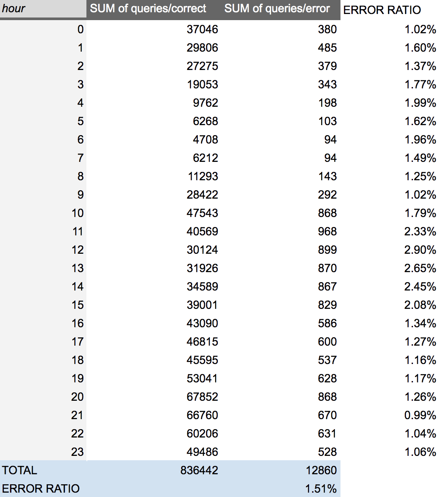
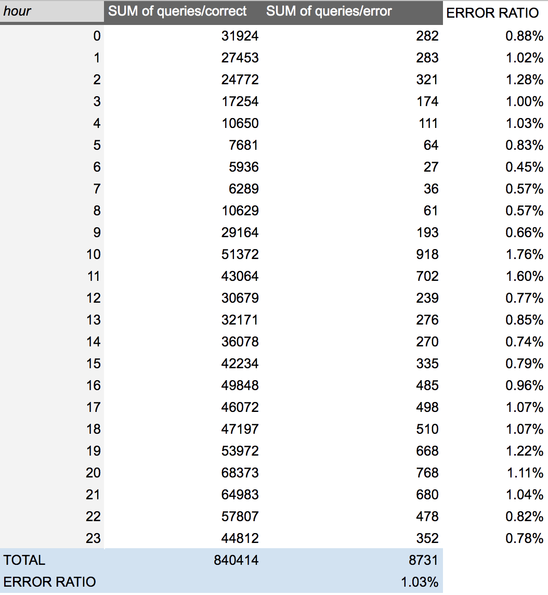

## DAM19 - 1st ASSIGMENT 

#### <u> Executive Summary </u>

* There's a decrease in the number of error from 
1.51% to 1.03% in September which represents a 0.48% less.

* The error ratio percentage change has decreased in 32.11%.

* I've established an improvement of more than 20% in our error ratio as our threshold for the bonus payout.

* The members of the team has shown effectiveness and a good performance in resolving the problem and all of them deserve a bonus payout.

#### <u> Case Study </u>

Because the total number of queries sales in August and September are different it is difficult to compare the data for the two years and to determine whether or not there's any notable change in solving the problem. However, if the number of errors in every month is expressed as a percentage of the total queries, then it is easier to compare the data for the two months.

Percentages are also very useful if you wish to quantify change. In this case, this is because they provide us a result in the form of parts per hundred that is usually more readily understandable and comparable than when the information is presented as raw values.

To measure these results, we decide to take into account an error ratio which it's calculated with: 

```
100.0*(queries+errors/queries)
```

Grouped by hours along the day for the two different months as showed below:


*Insights from daily errors

We notice a significant decrease in the number of errors in september, however, we should sum up these figures to see the whole picture.
This process leads us to a reduction of 0.48% from August (1,51%) to September (1.03%).

On the other side, the number of queries has rised from 836442 to 840414 that's why I've decided to calculate the percentage change that turn into 32.11% decrease in error 

```
=100.0*(12860-8730)/12860
```

Therefore, I consider that the teamwork has been succefull and they have performed a efficient and excellent task in reducing the error in September. We have to take into account that an error ratio of 1.54% over 836442 queries implies a small number itself. Keeping this number is a good job itself and reducing it is even better.

I conclude that a bonus payout should be provide to the team.



*Insights from August log*



*Insights from September log*


