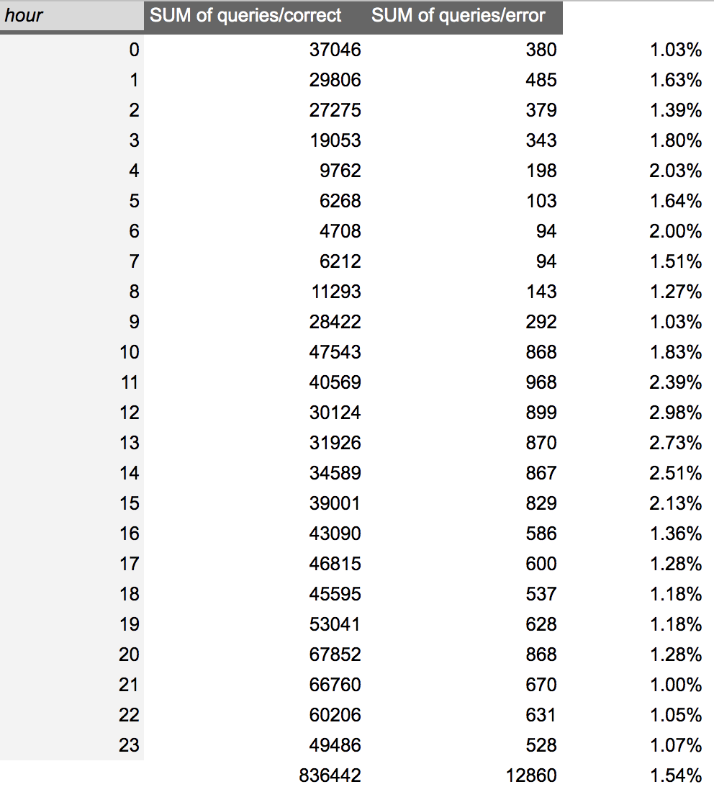

## DAM19 - 1st ASSIGMENT 

#### <u> Executive Summary </u>

* The members of the team has showed an efficiency and a good performance in resolving the problem and all of them deserve a bonus payout.

* To measure this results, we decided to take into account an error ratio which represents only a 1.04% in September from the total number of queries.

* This ratio has been reduced in 0.5% from August (1,54%) to September, which represents an amount of 4129 errors less than in August.

* The number of queries has rise from 836442 to 840414 and the number of error has decreased from 12860 to 8731, even with more queries per month.

* The decrease in number of error represents a 47% less in the previous month

### <u>FINDINGS</u>

One of the main questions is:

1. What do we consider as efficiency? Where we find a robust system with a high number of queries and a low number of errors.

2. Reducing the error ratio #errors/#queries implies improving the performance

3. The results show that the performance was really good in August with only 1.54% of errors. They have managed to reduce this quantity to 1.04% and this number represents a 47% descrease in the number of errors.

*Insights from August log*

*Insights from September log*

4. The perfomance actually was really good and keeping the same way represents itself a good work. After digging in the problem during the August they has managed to reduce this ratio even in a 0.5% showing an excellent result.

5. Do they deserve a bonus payout?

[to be finished]

